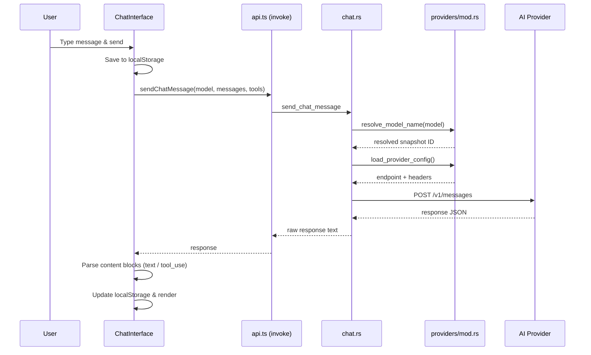
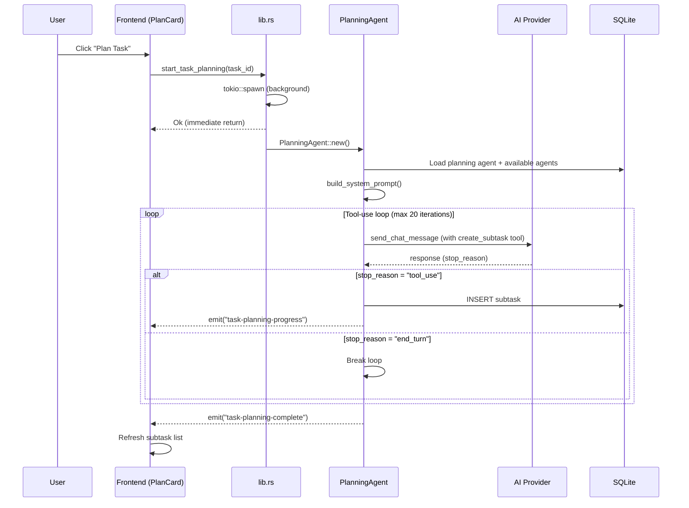
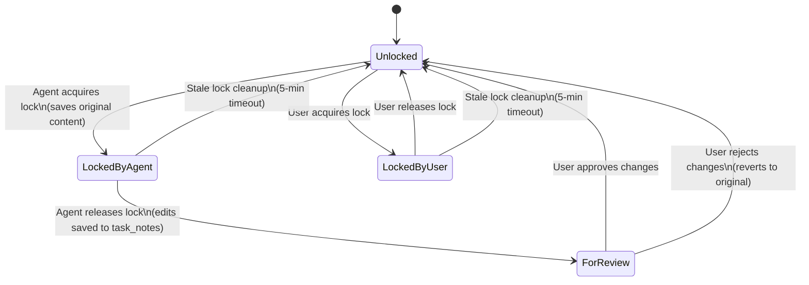
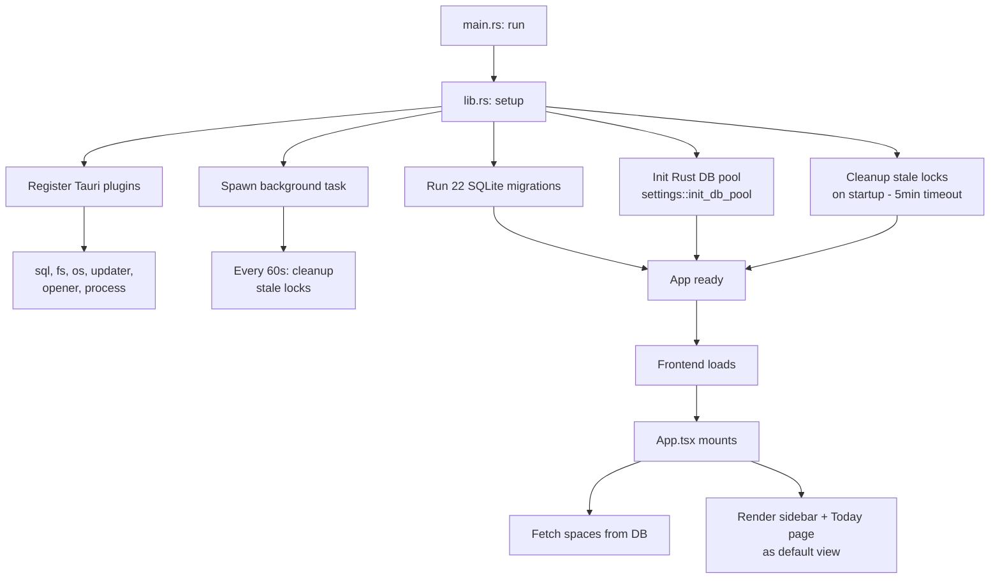
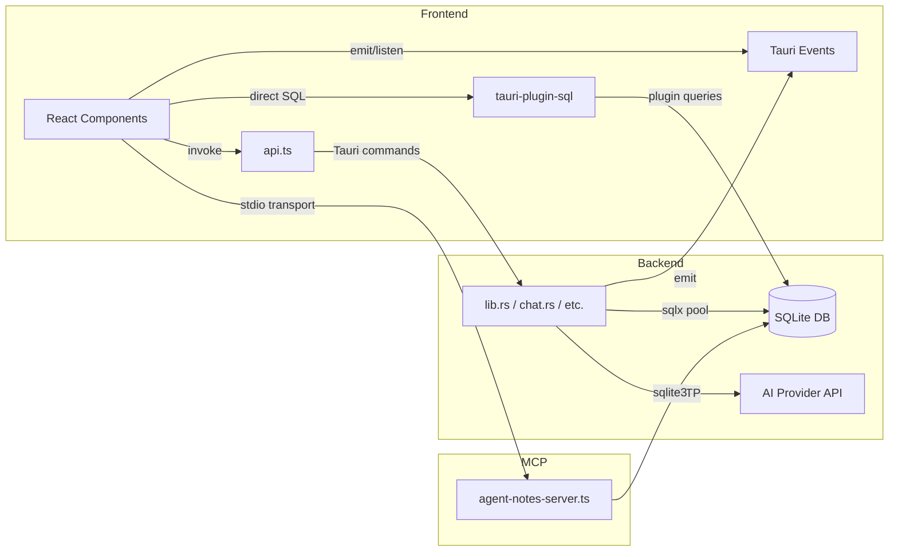

# Orcas Agent Manager - Guide for AI Assistants

## What is Orcas?

A macOS desktop app for managing AI agent workflows. Users organize work in Spaces > Tasks > Subtasks, delegate to AI agents, and collaborate on shared documents with review workflows.

## Technology Stack

- **Frontend**: React 19 + TypeScript 5.8 + Vite 7
- **Backend**: Tauri 2 (Rust)
- **Database**: SQLite via `tauri-plugin-sql` + `sqlx` (22 migrations in `src-tauri/src/lib.rs`)
- **AI Integration**: Anthropic SDK (`@anthropic-ai/sdk`), LiteLLM gateway support
- **UI Framework**: Primer React 37 (GitHub's design system) + Primer Octicons
- **Markdown Editor**: MDX Editor (`@mdxeditor/editor`)
- **Agent Tools**: Inline tool definitions in ChatInterface + MCP server via `@modelcontextprotocol/sdk`
- **Platform Features**: macOS calendar integration (EventKit via Objective-C bridge)
- **Styling**: Plain CSS with CSS custom properties (`src/App.css`)

IMPORTANT: The `<Box>` element is deprecated. NEVER INTRODUCE IT IN NEW CODE.

## Project Structure

```
orcas-desktop/
├── src/                        # Frontend React application
│   ├── App.tsx                 # Main app component, routing, sidebar nav
│   ├── App.css                 # Global styles, CSS variables, layout
│   ├── api.ts                  # Tauri command wrappers + direct SQL queries
│   ├── types.ts                # TypeScript interfaces (Space, Task, Agent, Chat, Calendar)
│   ├── providers.ts            # Provider metadata and settings field definitions
│   ├── components/             # React components
│   │   ├── ChatInterface.tsx   # AI chat with streaming, agent tools, edit locks
│   │   ├── AgentsManager.tsx   # Agent CRUD
│   │   ├── TaskDetail.tsx      # Task view with MDX editor, edit locks, subtasks
│   │   ├── PlanCard.tsx        # Task planning display (autonomous agent output)
│   │   ├── SpaceHome.tsx       # Space overview and task list
│   │   ├── AgendaView.tsx      # Calendar agenda display
│   │   ├── CalendarSettings.tsx# Calendar permission and source management
│   │   ├── Settings.tsx        # App settings (API keys, provider selection)
│   │   ├── TodayPage.tsx       # Today page (default view) with calendar, tasks, and chat
│   │   ├── TodayTaskList.tsx   # Task list for today view
│   │   ├── AgentSelector.tsx   # Agent selection dropdown
│   │   ├── EventPopover.tsx    # Calendar event details popup
│   │   ├── StatusChip.tsx      # Task status badge component
│   │   └── UpdateNotification.tsx # App update notification
│   ├── utils/                  # Utilities
│   │   ├── retry.ts            # Exponential backoff (skips 4xx except 429)
│   │   ├── tokenEstimation.ts  # Token counting + message compaction (80k budget)
│   │   └── videoConferencing.ts# Meeting link extraction, attendee formatting
│   └── mcp-servers/            # In-process MCP server (stdio transport)
│       ├── agent-notes-server.ts # MCP tool definitions
│       └── database-utils.ts   # SQLite helpers for MCP server
├── src-tauri/                  # Tauri Rust backend
│   └── src/
│       ├── main.rs             # Entry point → agent_manager_lib::run()
│       ├── lib.rs              # Tauri commands, 22 migrations, plugin setup
│       ├── chat.rs             # Chat message routing to providers
│       ├── planning_agent.rs   # Autonomous task planning with tool-use loop
│       ├── edit_locks.rs       # Document concurrency control (5-min timeout)
│       ├── task_notes.rs       # Task document persistence
│       ├── database.rs         # Data model structs (Space, Task, SubTask, Agent)
│       ├── settings.rs         # Settings CRUD (global DB pool via OnceLock)
│       ├── space_context.rs    # Space-level context markdown
│       ├── calendar.rs         # macOS EventKit integration (Objective-C bridge)
│       └── providers/
│           └── mod.rs          # Provider trait, Anthropic + LiteLLM configs
├── docs/                       # Documentation
│   ├── USER_FLOWS.md           # Visual workflow diagrams (best overview)
│   ├── README_MCP.md           # MCP setup and tools
│   └── CHAT_INTERFACE_REVIEW.md
├── .claude/                    # Claude Code configuration
│   ├── settings.json           # Hook configuration
│   └── hooks/
│       └── session-start.sh    # SessionStart hook (npm install)
└── .beads/                     # Issue tracking (bd command)
```

## Core Concepts

### Data Hierarchy
```
Space (container, formerly "Project")
  └─ Task (work unit requiring review)
      └─ Subtask (executable step, can be delegated to agents)
```

### Task Status Flow
`todo` → `in_progress` → `for_review` → `done`

### Document Collaboration
- Tasks have shared markdown documents (`task_notes` table)
- Edit locks prevent concurrent modifications (`agent_edit_locks` table)
- Locks store original content for diff/review view
- Users review and approve/reject agent changes
- Stale locks auto-cleaned every 60s (5-minute timeout)

### Agent System
- Agents have custom prompts, model selection, and optional web search
- System agents (Planning Agent with `system_role='planning'`) handle specific workflows
- Planning agent uses a tool-use loop (max 20 iterations) to create 3-7 subtasks
- Agents interact via chat and use agent tools (defined in ChatInterface.tsx) to read/write documents, query tasks, calendar, and other agents
- 3 additional MCP server tools (via stdio transport in `mcp-servers/agent-notes-server.ts`) provide direct database access for agent notes
- Agent-task associations tracked in `task_agent_sessions` table

### Database Tables
`spaces`, `tasks`, `subtasks`, `agents`, `task_agent_sessions`, `agent_notes`, `task_notes`, `settings`, `agent_edit_locks`, `event_space_associations`

## Key Flows

### Chat Message Flow



### Task Planning Flow



### Document Edit Lock Flow



### Application Startup



### Data Flow Architecture



## State Management

- Component-level state via React hooks (useState/useEffect)
- No global state library (no Redux, Zustand, or Context API at root)
- Props drilling for data propagation between components
- localStorage for chat history (`chat-task-${taskId}-agent-${agentId}`, `chat-today-agent-${agentId}`)
- Tauri events for cross-component communication

## Tauri Commands (29 total)

### lib.rs
- `start_task_planning` - Spawns background planning agent
- `get_available_models` - Fetches models from configured provider
- `resolve_model_id` - Resolves friendly name to snapshot ID
- `check_model_supports_tools` - Checks tool support for a model
- `request_calendar_permission` - Requests macOS calendar access
- `get_calendar_list` - Retrieves system calendars
- `get_events_for_date` - Fetches events for a date
- `open_calendar_settings` - Opens macOS calendar privacy panel
- `get_tasks_scheduled_for_date` - Tasks scheduled for a date
- `get_recently_edited_tasks` - Tasks modified in past N hours
- `tag_event_to_space` / `untag_event_from_space` - Event-space associations
- `get_event_space_tags` / `get_space_events` - Query event-space associations

### chat.rs
- `send_chat_message` - Routes to provider, resolves models, returns raw response
- `test_connection` - Validates provider credentials

### settings.rs
- `get_setting` / `set_setting` / `delete_setting` - Key-value settings store

### edit_locks.rs
- `acquire_edit_lock` / `release_edit_lock` / `check_edit_lock` - Lock management
- `get_original_content` - Original content for diff view
- `force_release_all_locks` / `cleanup_stale_locks` - Lock cleanup

### task_notes.rs
- `read_task_notes` / `write_task_notes` - Task document persistence

### space_context.rs
- `read_space_context` / `write_space_context` - Space context markdown

## Agent Tools (ChatInterface.tsx)

9 tools available to agents during task chat:
- `read_task_notes` - Read the shared markdown document for a task
- `write_task_notes` - Write or append content to a task's document (supports `append` and `replace` operations)
- `check_task_notes_exists` - Check if a task document exists
- `update_space_context` - Update the shared space context markdown
- `read_space_context` - Read the shared space context markdown
- `get_task_details` - Get full details of a task including subtasks, notes, and space info
- `list_space_tasks` - List all tasks in a space with optional status filtering
- `get_calendar_events` - Get calendar events for a specific date
- `list_agents` - List all available agents with names, models, and descriptions

### MCP Server Tools (agent-notes-server.ts)

3 additional tools via MCP stdio transport (used by planning agent):
- `read_task_notes` - Read task notes from `agent_notes` table
- `write_task_notes` - Write/append to agent notes (supports `append` and `replace` operations)
- `update_space_context` - Update space-level context markdown (updates `spaces.context_markdown` column)

## Event-Driven Communication

### Rust → Frontend (Tauri emit)
- `task-planning-progress` - Planning agent progress updates (status, message, progress 0.0-1.0)
- `task-planning-complete` - Planning finished (task_id, success, message, subtasks_created, error)

### Frontend ↔ Frontend (Tauri emit/listen)
- `agent-edit-lock-changed` - Document lock state changed (emitted by ChatInterface, listened by TaskDetail)

## Provider System

### Supported Providers
1. **Anthropic** - Direct API (`https://api.anthropic.com/v1/messages`)
   - Auth: `x-api-key` header, `anthropic-version: 2023-06-01`
   - API key from settings or `ANTHROPIC_API_KEY` env var
2. **LiteLLM** - Gateway (`{base_url}/v1/messages`)
   - Auth: `Authorization: Bearer {api_key}`
   - Requires base_url and api_key from settings

### Model Resolution
- Strips date suffix: `claude-sonnet-4-20250514` → `claude-sonnet-4`
- Tool-capable prefixes: `claude-`, `gpt-4`, `gpt-3.5-turbo`, `gemini-`, `mistral-large`, `mistral-medium`, `command-r`

### Provider Trait
```rust
pub trait ProviderConfig: Send + Sync {
    fn get_endpoint(&self) -> String;
    fn get_headers(&self) -> HashMap<String, String>;
    fn validate(&self) -> Result<(), String>;
    fn get_models_endpoint(&self) -> String;
}
```

## Common Development Tasks

### Adding a New Tauri Command
1. Define command function with `#[tauri::command]` in the appropriate `.rs` file
2. Register in the `invoke_handler` in `lib.rs`
3. Add wrapper function in `src/api.ts`
4. Use from React components via `invoke()`

### Adding a New React Component
1. Create component in `src/components/`
2. Import in appropriate parent component or `App.tsx`
3. Style using Primer React components or CSS classes in `App.css`

### Database Schema Changes
1. Add migration in `src-tauri/src/lib.rs` (migrations array, currently 22)
2. Increment the version number
3. Update relevant query functions
4. Test migration path from previous version

### Adding Agent Tools
1. Define the tool schema and handler in `src/components/ChatInterface.tsx` (in the `agentTools` array and `executeAgentTool` function)
2. Tools have access to Tauri invoke commands and can call any api.ts function

### Adding MCP Server Tools
1. Update `src/mcp-servers/agent-notes-server.ts` with new tool definition
2. Add tool handler in the `CallToolRequestSchema` handler
3. Use `database-utils.ts` helpers for database access

## Development Workflow

```bash
npm install          # Install dependencies
npm run dev          # Vite dev server (port 1420)
npm run build        # TypeScript check + Vite production build
npm run tauri dev    # Full Tauri development mode
npm run tauri build  # Production build
```

### Database
- macOS location: `~/Library/Application Support/com.orcas.dev/orcascore.db`
- Schema defined in `src-tauri/src/lib.rs` migrations
- Dual pool: `tauri-plugin-sql` for frontend, `sqlx` OnceLock pool for Rust backend
- Debug: `sqlite3 <path-to-db>`

### Configuration Files
- `vite.config.ts` - Vite build config (port 1420, React plugin)
- `tsconfig.json` - TypeScript config (ES2020, strict mode, bundler resolution)
- `src-tauri/Cargo.toml` - Rust dependencies
- `src-tauri/tauri.conf.json` - Tauri app configuration

## Architectural Patterns

### Background Tasks
- **Stale lock cleanup**: Runs on startup + every 60 seconds (5-minute lock timeout)
- **Planning agent**: Spawned per request via `tokio::spawn`, communicates via events

### CSS Conventions
- CSS custom properties for theming: `--spacing-unit`, `--base-font-size`, `--border-color`, etc.
- BEM-like naming: `.task-details-header`, `.chat-pane`, `.plan-card-container`
- Chat messages: `.mcu` (user, right-aligned blue) / `.mca` (assistant, left-aligned white)
- Animation: `@keyframes messageSlideIn` for chat messages

### Token Budget Management
- `compactMessages()` keeps conversations within 80,000 token budget
- Always preserves last 5 messages
- Drops oldest messages first, adds notice when truncated

## Common Pitfalls

1. **Don't skip edit lock checks** - Always verify lock status before modifying task_notes
2. **Handle async properly** - Planning agent runs in background, use events for updates
3. **Validate provider config** - Check API keys are set before AI calls
4. **Clean up MCP server** - Stop server process on app exit
5. **Preserve message history** - ChatInterface uses localStorage, don't clear without user action
6. **Dual database pools** - Frontend uses `tauri-plugin-sql`, Rust uses `settings::DB_POOL` (OnceLock) — keep both in sync
7. **Don't use `<Box>`** - Deprecated Primer component, use standard HTML or other Primer components instead

## Issue Tracking

Use `bd` (beads) for all issue tracking:

```bash
bd ready              # Find available work
bd show <id>          # View issue details
bd update <id> --status in_progress  # Claim work
bd close <id>         # Complete work
bd sync               # Sync with git
```

## Session Completion

Work is NOT complete until `git push` succeeds.

1. File issues for remaining work (`bd create`)
2. Run quality gates if code changed
3. Close finished issues (`bd close`)
4. Push:
   ```bash
   git pull --rebase && bd sync && git push
   git status  # MUST show "up to date with origin"
   ```
5. **Clean up** - Clear stashes, prune remote branches
6. **Verify** - All changes committed AND pushed
7. **Hand off** - Provide context for next session

**CRITICAL RULES:**
- Work is NOT complete until `git push` succeeds
- NEVER stop before pushing - that leaves work stranded locally
- NEVER say "ready to push when you are" - YOU must push
- If push fails, resolve and retry until it succeeds
