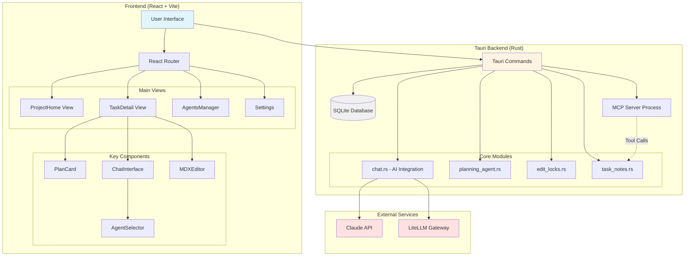
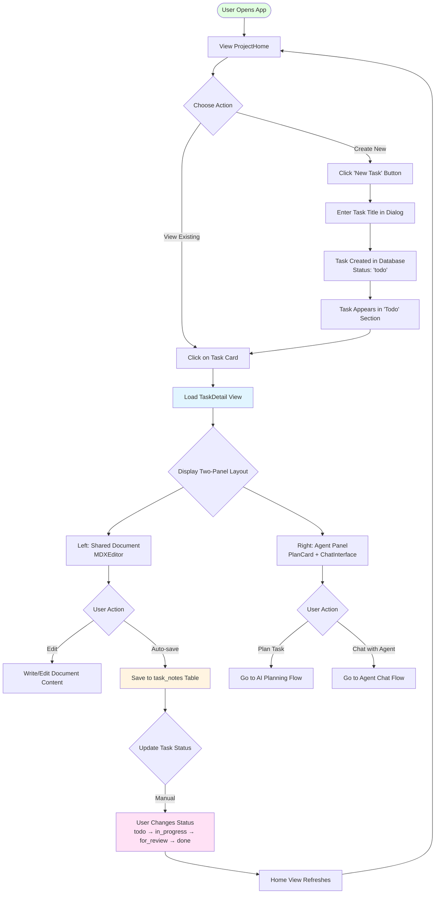
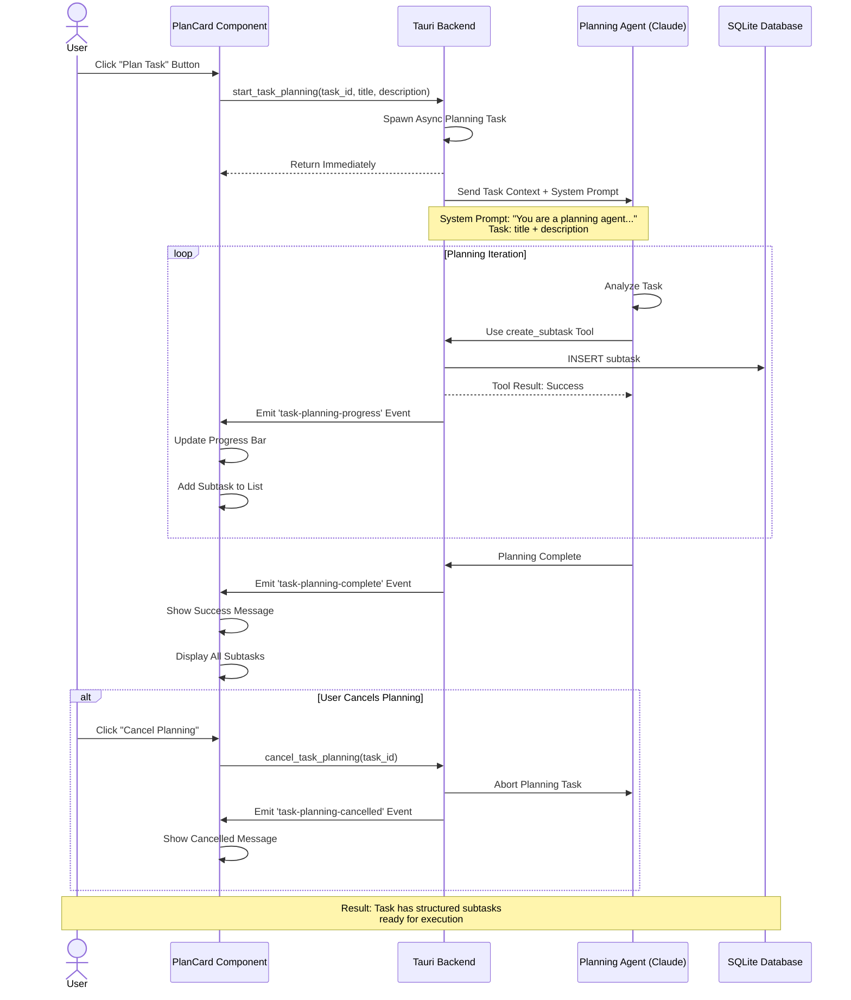
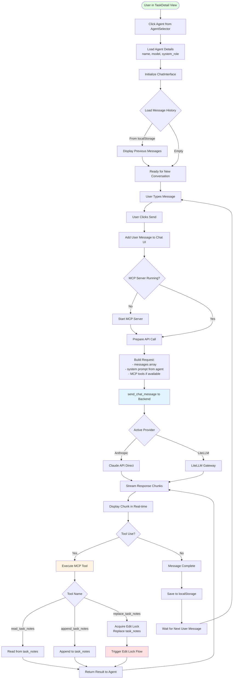
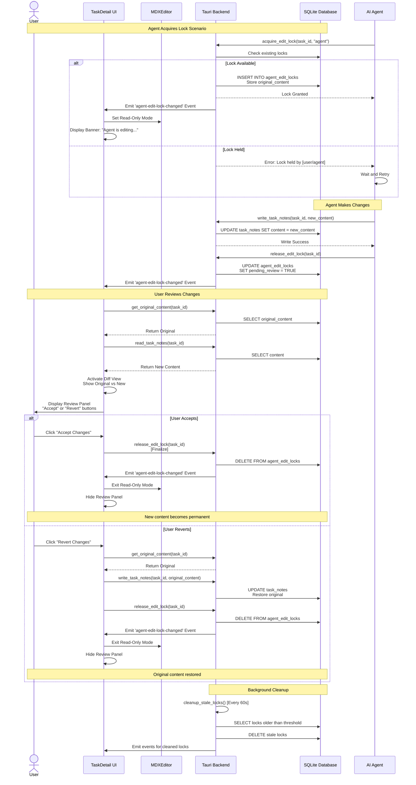
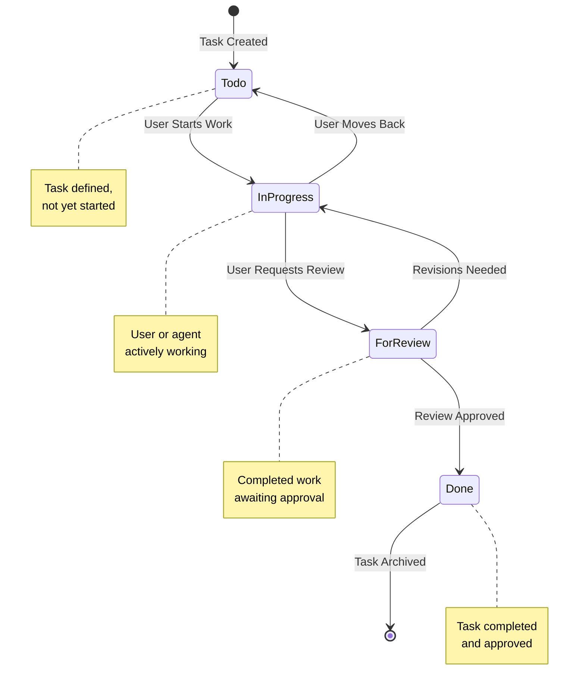
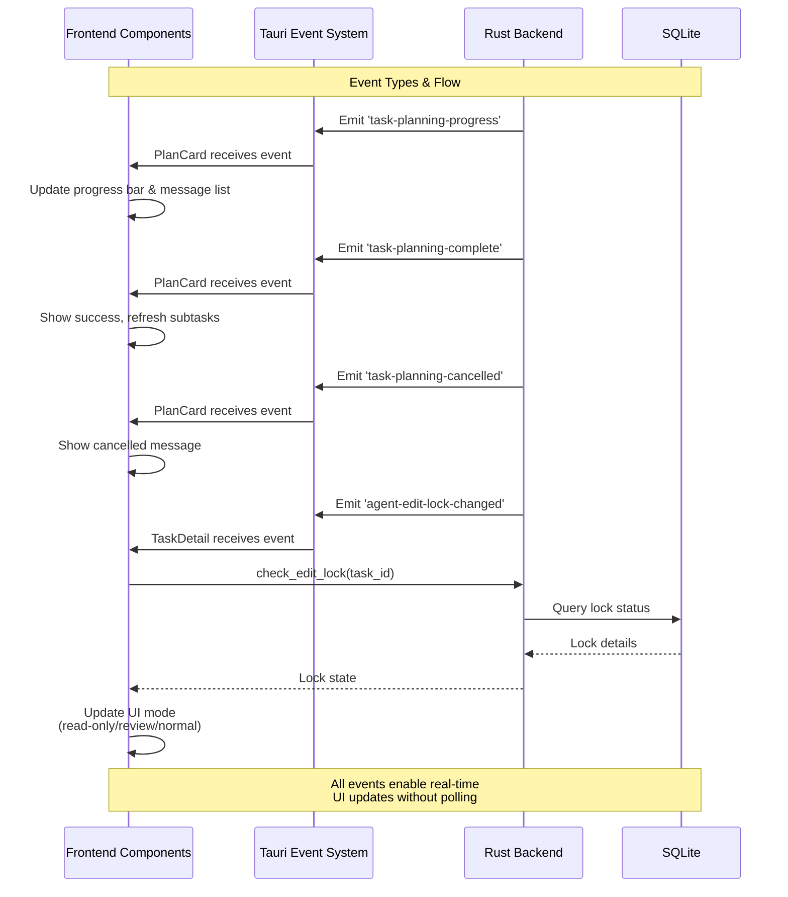

# Orcas Agent Manager - User Flows

This document provides visual diagrams of the core user flows in the Orcas Agent Manager application.

## Table of Contents
- [Application Architecture](#application-architecture)
- [Task Management Flow](#task-management-flow)
- [AI Task Planning Flow](#ai-task-planning-flow)
- [Agent Chat Interaction Flow](#agent-chat-interaction-flow)
- [Document Edit Lock & Review Flow](#document-edit-lock--review-flow)
- [Agent Management Flow](#agent-management-flow)
- [Provider Configuration Flow](#provider-configuration-flow)

---

## Application Architecture



---

## Task Management Flow



---

## AI Task Planning Flow



---

## Agent Chat Interaction Flow



---

## Document Edit Lock & Review Flow



---

## Agent Management Flow

```mermaid
flowchart TD
    Start([User Opens App]) --> NavSettings[Navigate to Settings]
    NavSettings --> ClickAgents[Click 'Agents' Tab]
    ClickAgents --> LoadAgents[Load AgentsManager Component]

    LoadAgents --> FetchAgents[Fetch All Agents from Database]
    FetchAgents --> DisplayList[Display Agent List]
    DisplayList --> SplitView{Categorize Agents}

    SplitView -->|System Agents| ShowSystem[Show Read-Only System Agents<br/>e.g., Planning Agent]
    SplitView -->|User Agents| ShowUser[Show User-Created Agents<br/>with Edit/Delete Options]

    ShowSystem --> UserAction{User Action}
    ShowUser --> UserAction

    UserAction -->|Create New| CreateFlow[Create New Agent Flow]
    UserAction -->|Edit Existing| EditFlow[Edit Agent Flow]
    UserAction -->|Delete| DeleteFlow[Delete Agent Flow]
    UserAction -->|Done| Exit([Return to App])

    CreateFlow --> ClickCreate[Click 'Create Agent' Button]
    ClickCreate --> ShowForm[Show Agent Form Dialog]
    ShowForm --> EnterDetails[Enter Agent Details:<br/>- Name<br/>- Model Selection<br/>- System Prompt]

    EnterDetails --> FetchModels{Models Available?}
    FetchModels -->|No| GetModels[get_available_models()<br/>from Active Provider]
    FetchModels -->|Yes| ShowModelDropdown[Display Model Dropdown]
    GetModels --> ShowModelDropdown

    ShowModelDropdown --> SelectModel[User Selects Model]
    SelectModel --> SaveAgent[Click 'Save']
    SaveAgent --> ValidateInput{Validate Input}

    ValidateInput -->|Invalid| ShowError[Show Validation Error]
    ValidateInput -->|Valid| InsertDB[INSERT INTO agents TABLE]
    ShowError --> EnterDetails

    InsertDB --> RefreshList[Refresh Agent List]
    RefreshList --> DisplayList

    EditFlow --> SelectAgent[Click on Agent Card]
    SelectAgent --> LoadEditForm[Load Agent in Edit Form]
    LoadEditForm --> ModifyDetails[Modify Name/Model/Prompt]
    ModifyDetails --> SaveChanges[Click 'Save']
    SaveChanges --> UpdateDB[UPDATE agents TABLE]
    UpdateDB --> RefreshList

    DeleteFlow --> ClickDelete[Click Delete Button]
    ClickDelete --> ConfirmDelete{Confirm Deletion?}
    ConfirmDelete -->|No| UserAction
    ConfirmDelete -->|Yes| RemoveDB[DELETE FROM agents TABLE]
    RemoveDB --> RefreshList

    style Start fill:#e1ffe1
    style InsertDB fill:#fff4e1
    style UpdateDB fill:#fff4e1
    style RemoveDB fill:#ffe1e1
    style Exit fill:#e1ffe1
```

---

## Provider Configuration Flow

```mermaid
flowchart TD
    Start([User Opens Settings]) --> LoadSettings[Load Settings Component]
    LoadSettings --> FetchProvider[Fetch Current Provider<br/>get_setting('provider')]
    FetchProvider --> DisplayForm[Display Provider Configuration Form]

    DisplayForm --> SelectProvider{User Selects Provider}

    SelectProvider -->|Anthropic| ShowAnthropicForm[Show Anthropic Config Form]
    SelectProvider -->|LiteLLM| ShowLiteLLMForm[Show LiteLLM Config Form]

    ShowAnthropicForm --> AnthropicFields[Fields:<br/>- API Key<br/>- Model Preferences]
    ShowLiteLLMForm --> LiteLLMFields[Fields:<br/>- API Key<br/>- Base URL<br/>- Model Preferences]

    AnthropicFields --> EnterCreds[User Enters Credentials]
    LiteLLMFields --> EnterCreds

    EnterCreds --> ClickSave[Click 'Save Settings']
    ClickSave --> ValidateFields{Validate Input}

    ValidateFields -->|Missing Required| ShowError[Show Error Message]
    ValidateFields -->|Valid| SaveToDB[Save to settings TABLE]

    ShowError --> EnterCreds

    SaveToDB --> SetProvider[set_setting('provider', selected)]
    SetProvider --> SetAPIKey[set_setting('anthropic_api_key', ...)<br/>or<br/>set_setting('litellm_api_key', ...)]
    SetAPIKey --> SetBaseURL{Is LiteLLM?}

    SetBaseURL -->|Yes| SaveBaseURL[set_setting('litellm_base_url', ...)]
    SetBaseURL -->|No| SettingsSaved[Settings Saved Successfully]
    SaveBaseURL --> SettingsSaved

    SettingsSaved --> ShowSuccess[Display Success Message]
    ShowSuccess --> ReloadModels[Trigger Model List Reload]
    ReloadModels --> CallGetModels[get_available_models()]

    CallGetModels --> ProviderCheck{Which Provider?}

    ProviderCheck -->|Anthropic| AnthropicAPI[Call Anthropic Models API<br/>List all Claude models]
    ProviderCheck -->|LiteLLM| LiteLLMAPI[Call LiteLLM Models Endpoint<br/>GET /v1/models]

    AnthropicAPI --> ParseResponse[Parse Model Response]
    LiteLLMAPI --> ParseResponse

    ParseResponse --> StoreModels[Store Available Models in Memory]
    StoreModels --> UpdateUI[Update AgentsManager Model Dropdown]
    UpdateUI --> Ready[Provider Configured & Ready]
    Ready --> End([User Can Use AI Features])

    style Start fill:#e1ffe1
    style SaveToDB fill:#fff4e1
    style AnthropicAPI fill:#e1f5ff
    style LiteLLMAPI fill:#e1f5ff
    style End fill:#e1ffe1
```

---

## Data Model Hierarchy

```mermaid
erDiagram
    PROJECT ||--o{ TASK : contains
    TASK ||--o{ SUBTASK : "broken into"
    TASK ||--|| TASK_NOTES : has
    TASK ||--o| AGENT_EDIT_LOCK : "may have"
    SUBTASK }o--o| AGENT : "assigned to"
    TASK }o--o{ AGENT : "interacts via"

    PROJECT {
        int id PK
        string title
        string description
        string color
        datetime created_at
        datetime updated_at
    }

    TASK {
        int id PK
        int project_id FK
        string title
        string description
        string status
        int priority
        date due_date
        string notes_file_path
        datetime created_at
        datetime updated_at
    }

    SUBTASK {
        int id PK
        int task_id FK
        string title
        string description
        boolean completed
        int agent_id FK
        datetime created_at
        datetime updated_at
    }

    AGENT {
        int id PK
        string name
        string model_name
        text agent_prompt
        string system_role
        datetime created_at
        datetime updated_at
    }

    TASK_NOTES {
        int task_id PK_FK
        text content
        datetime updated_at
    }

    AGENT_EDIT_LOCK {
        int task_id PK_FK
        string locked_by
        text original_content
        boolean pending_review
        datetime locked_at
    }
```

---

## Status Flow



---

## Key User Journeys

### Journey 1: First-Time User Setup
1. Open Orcas application
2. Navigate to Settings
3. Select AI provider (Anthropic or LiteLLM)
4. Enter API credentials
5. System validates and loads available models
6. Navigate to Agents tab
7. Create first custom agent with selected model
8. Ready to create tasks and delegate to agents

### Journey 2: Task Execution with AI Planning
1. Create new task with title and description
2. Open task in TaskDetail view
3. Click "Plan Task" to invoke AI planning
4. Planning agent analyzes task and creates subtasks
5. User reviews generated subtasks
6. User selects agent from AgentSelector
7. User sends instructions via chat
8. Agent executes subtask and updates shared document
9. User reviews changes (diff view)
10. User accepts changes
11. User marks subtask as complete
12. Repeat for remaining subtasks
13. User marks task as "done"

### Journey 3: Direct Agent Collaboration
1. Open existing task
2. Write initial context in shared document (left pane)
3. Select specialized agent from AgentSelector (right pane)
4. Engage in chat conversation about the task
5. Agent requests to edit document (acquires lock)
6. User sees "agent editing" indicator
7. Agent makes changes to shared document
8. User enters review mode (diff view)
9. User accepts or reverts changes
10. Continue iteration or move to next task

---

## Event-Driven Architecture



---

## Summary

The Orcas Agent Manager provides a structured workflow for:

1. **Task Organization**: Hierarchical project → task → subtask structure
2. **AI-Powered Planning**: Automated task breakdown using Claude AI
3. **Human-AI Collaboration**: Shared document editing with review workflows
4. **Agent Management**: Customizable AI agents with different models and prompts
5. **Flexible Integration**: Support for multiple AI providers (Anthropic, LiteLLM)

The application emphasizes:
- Clear separation between planning and execution
- Safe concurrent editing with lock mechanisms
- Real-time updates via event-driven architecture
- User control over AI suggestions through review workflows
